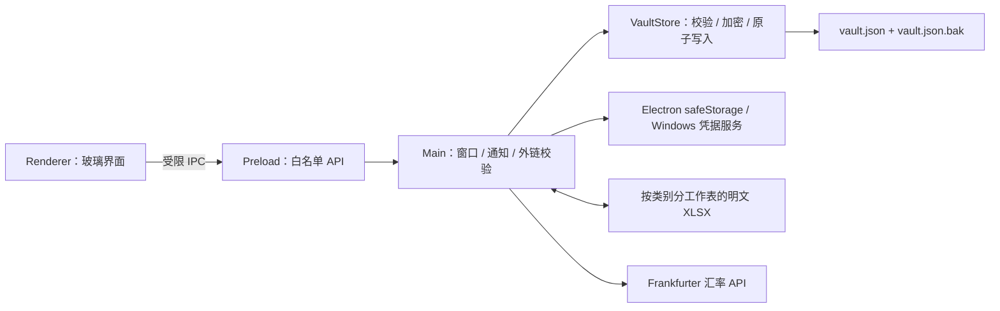

# 架构与数据模型

## 进程边界

- 渲染进程启用 `contextIsolation` 和 Chromium sandbox，关闭 `nodeIntegration`。
- Preload 只暴露记录、类别、排序、偏好、汇率刷新、表格导入导出、窗口控制和安全外链所需的方法。
- 表格导入导出均由主进程显示系统文件对话框，渲染进程不接触文件系统路径或读写 API。
- 外部地址仅允许 `http:` 与 `https:`；所有新窗口请求都由主进程拦截。
- `bootstrap` 在当前 Windows 用户上下文中解密账号、密码、地址和备注；账号与密码进入渲染进程后直接完整显示，不设置查看/隐藏切换链路。

## 品牌资源

- 用户可见名称统一为“账耗”，左上角英文副标题为 `NEZUMI SUBSCRIPTION`；内部英文包名为 `nezumi-subscription`，应用 ID 为 `local.nezumi.subscription`，保险库位于 `%APPDATA%\nezumi-subscription`。
- `build/icon.png` 是 `1024 × 1024` 的透明冰晶仓鼠母图；主体外背景已移除并保留透明安全边距，图形不包含文字，便于后续更换软件名称。
- `build/icon.ico` 由母图封装为 `16、20、24、32、40、48、64、128、256` 九种尺寸，供 Electron Builder、程序文件和桌面快捷方式统一使用。
- 图标测试会解码 PNG 像素，确认最外圈完全透明且画面中心存在主体，防止灰底或键控底色重新进入正式资源。

## 持久化模型

`vault.json` 顶层字段：

| 字段 | 说明 |
| --- | --- |
| `version` | 数据结构版本，当前为 3 |
| `categories` | `{id, name, color}` 列表 |
| `records` | 账号记录；订阅和充值是可选特征 |
| `preferences` | 提醒天数、音效、置顶、界面透明度和最近通知日期 |
| `exchangeRates` | 人民币基准汇率、数据日期、更新时间和来源 |

记录以 `hasSubscription` 和 `isPrepaid` 两个布尔字段表达可叠加特征，不划分账号类型。`account`、`password`、`address`、`notes` 以 `enc:v1:<base64>` 格式保存；base64 内是 Windows 用户上下文加密后的二进制，不是明文编码。

## 记录特征

| 特征 | 必填字段 | 保存内容 | 统计与提醒 |
| --- | --- | --- | --- |
| 基础记录 | 名称 | 类别、账号、密码、地址、备注 | 不进入到期提醒和月均支出 |
| `hasSubscription` | 有效到期日、非负金额 | 日期、金额、币种、账期 | 进入到期提醒和月均支出 |
| `isPrepaid` | 无额外必填项 | 标记已充值、按量消费 | 显示“充值”标签，不计入周期支出 |

## 到期状态

| 条件 | 状态 | 视觉表现 |
| --- | --- | --- |
| 日期早于今天 | `expired` | 红色光带与脉冲点 |
| 今天至 3 天 | `urgent` | 红色光带与脉冲点 |
| 4 天至提醒阈值（默认 14 天） | `soon` | 琥珀色光带 |
| 其余有效日期 | `normal` | 类别色光带 |
| 未开启订阅 | `neutral` | 类别色细光带，到期和费用列显示 `-` |

日期按本地自然日中午计算，避免夏令时或午夜时区偏移造成天数跳变。

## 玻璃渲染

1. BrowserWindow 使用透明、无框、`thickFrame: false`、`roundedCorners: false` 和 `hasShadow: false`，并在创建后显式调用 `setHasShadow(false)`；系统背景材质保持 `none`。Windows 下关闭 Electron 硬件加速，避免大尺寸透明交换链被 GPU 合成为黑色。
2. 页面根节点保持透明，应用外壳向内留出 68px 投影与折射饰边区域且不建立整窗 CSS `clip-path` 离屏层；窗口尺寸为 `1288 × 868`，外壳内容区域仍保持 `1152 × 732`，最外层折射框距窗口边缘 61px。
3. 主进程用 `BrowserWindow.setShape()` 完成透明 HWND 的圆角区域设置；首次显示前重新应用区域，并在隐藏状态下执行一次 1px 往返位移，让 DWM 提前完成窗口位置重算，清除原本会保留到用户第一次移动窗口的创建期直角边界与原生阴影。
4. `preferences.interfaceOpacity` 以 `50–100` 的整数保存主题透明度，默认 `100`。渲染层将其转换为 `--interface-opacity: 0.5–1`，按比例作用于外壳、侧栏、统计卡、记录卡、搜索框和空状态的玻璃底色；文字、图标、边界、高光和投影不继承整体 `opacity`，因此调低底色时仍保持清晰。
5. 外壳使用 1px 半透明实心边界；独立 `.glass-rim` 向外扩展 `7px`，用 1px 外层折射渐变、1px 内层弱反光和方向性高光形成双层透明玻璃饰边。内层折射线与实心边界之间保留约 4px 完全透明区域，肉眼可辨且不拦截拖拽或点击。
6. 外壳本身只保留内侧高光；投影全部挂载在 `.glass-rim`。外框使用中性黑色的接触、环境、中距和主投影四层组合，主层为 `18px 32px -8px / 24%`。
7. 弹窗蒙版固定在主界面的 `68px` 内缩范围，使用低浓度遮罩和轻模糊；外层玻璃框与投影区域不参与蒙版。添加记录弹窗使用 8px 透明轨道、内缩渐变滑块，不显示浏览器默认滚动条。

## 凭据展示

1. `vault.json` 中账号和密码继续使用 `safeStorage` 密文落盘。
2. `VaultStore.publicRecord()` 解密后随 bootstrap 和保存结果返回当前记录的账号与密码。
3. 列表以自动换行文本完整展示账号与密码，不设置省略号或固定高度裁切；编辑框使用 `type="text"`，不保留眼睛按钮或临时 reveal IPC。

## 主题链路

1. 顶栏操作区按“主题、声音、悬浮、窗口控制”排列；主题使用与声音、悬浮一致的无文字图标按钮打开独立主题弹窗。范围滑杆的 `input` 事件即时更新 CSS 变量与百分比，`change` 事件通过现有偏好 IPC 持久化。
2. 主题弹窗只通过 `VaultStore.updatePreferences()` 提交 `50–100` 的透明度整数；缺失或越界值恢复默认。
3. “恢复默认”写回透明度 `100`。

## 记录列表与筛选

1. 列表顶部只显示一次“名称 / 类别、账号 / 密码、到期 / 状态、金额 / 账期、操作”列标题；空账号、空密码、未开启订阅的到期和费用均显示 `-`。
2. 名称左侧区域不重复显示“订阅”或“充值”标签。开启订阅的记录直接通过右侧到期、状态、金额和账期体现；已充值记录只在右侧费用栏显示“充值”。
3. “仅看订阅”是独立布尔筛选，可与类别和关键词筛选叠加；排序只作用于筛选后的记录。
4. 类别顺序就是侧栏和导出工作表顺序；管理类别通过上移、下移按钮更新数组顺序并立即持久化。

## 多币种支出

1. 渲染层先按账期折算月均金额，再使用 `exchangeRates.cnyPerUnit` 转为人民币后求和；一次性费用不进入月均支出。
2. 主进程每 12 小时通过 Electron `net.fetch` 请求 [Frankfurter v1](https://frankfurter.dev/v1/) 的人民币基准日汇率，校验完整后原子写入 `vault.json`。
3. 网络离线、超时或响应异常时直接返回最近一次成功缓存；首次获取前使用内置基准汇率，界面不会因汇率服务阻塞启动。

## 表格导入与导出链路

1. 左下角只保留一个“表格”按钮，以小型菜单承载导入和导出，避免侧栏堆叠操作项。
2. 导出时每个类别对应一个工作表，空类别也保留；列为名称、账号、密码、登录 / 订阅地址、订阅、到期日、账期、金额、币种、已充值和备注。
3. 工作簿首行冻结并启用筛选，到期日和金额分别使用日期与数字单元格；订阅、账期和已充值列带填写选项。导出文件不使用 `safeStorage` 加密。
4. 导入时以工作表名称作为类别名称，并把记录追加到现有保险库；同名类别直接复用，缺少的类别自动创建。
5. 解析器接受导出表头及常用别名，订阅和已充值使用“是 / 否”。单个文件最大 `25 MB`，单次最多 `10,000` 条记录。
6. `VaultStore.importRecords()` 会先校验整批记录并加密账号、密码、地址和备注，再执行一次原子持久化；任一行失败时不新增类别或记录，并在错误中标出工作表和行号。
